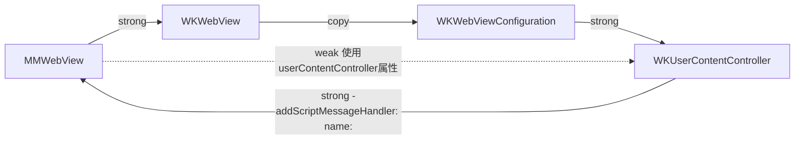
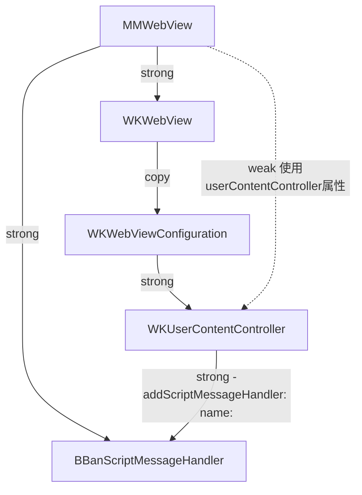

## WebView

基于常用的webView业务逻辑封装成一个`MMWebView`，内部使用`WKWebView`实现，将使用`WKWebView`过程中遇到的[一些问题](https://mp.weixin.qq.com/s/rhYKLIbXOsUJC_n6dt9UfA?)进行集中处理，对外部暴露简单的接口逻辑，并且提供一个和js交互的逻辑层。

主要的功能有与js交互的接口、安全执行js脚本、cookie的处理、文件跨域、清理缓存等等，具体的代码内部已经注释的很详细，下面仅对遇到的问题做一个摘要。

### WKScriptMessageHandler 导致的内存泄漏

先看一下形成的原因：



本来是不知道系统的`-addScriptMessageHandler: name:`方法会将传入的hanlder进行持有，这才形成了上面的循环引用，观看`WKUserContentController`的源码会发现内部实现如下：

```c++
- (void)addScriptMessageHandler:(id <WKScriptMessageHandler>)scriptMessageHandler name:(NSString *)name{
    auto handler = WebKit::WebScriptMessageHandler::create(std::make_unique<ScriptMessageHandlerDelegate>(self, scriptMessageHandler, name), name, API::UserContentWorld::normalWorld());
    if (!_userContentControllerProxy->addUserScriptMessageHandler(handler.get()))
        [NSException raise:NSInvalidArgumentException format:@"Attempt to add script message handler with name '%@' when one already exists.", name];
}
```

这段代码中使用`WebScriptMessageHandler`调用`create方法`接受传入的参数，下面看一下这个类关于该函数的相关文件：

```c++
// in WebScriptMessageHandler.h
class WebScriptMessageHandler : public RefCounted<WebScriptMessageHandler>, public Identified<WebScriptMessageHandler>  {
public:
    static Ref<WebScriptMessageHandler> create(std::unique_ptr<Client>, const String& name, API::UserContentWorld&);
private:
    WebScriptMessageHandler(std::unique_ptr<Client>, const String&, API::UserContentWorld&);

    std::unique_ptr<Client> m_client;
    String m_name;
    Ref<API::UserContentWorld> m_world;
};

// in WebScriptMessageHandler.mm
Ref<WebScriptMessageHandler> WebScriptMessageHandler::create(std::unique_ptr<Client> client, const String& name, API::UserContentWorld& world)
{
    return adoptRef(*new WebScriptMessageHandler(WTFMove(client), name, world));
}
WebScriptMessageHandler::WebScriptMessageHandler(std::unique_ptr<Client> client, const String& name, API::UserContentWorld& world)
    : m_client(WTFMove(client))
    , m_name(name)
    , m_world(world)
{
}
```

在WebScriptMessageHandler的public声明了这个create函数，然后其实现中是通过new一个`WebScriptMessageHandler`对象，调用下面的构造函数

```c++
WebScriptMessageHandler::WebScriptMessageHandler(std::unique_ptr<Client> client, const String& name, API::UserContentWorld& world)
```

进行初始化，将参数赋值到对象的属性里。因此，可以断定，`WKUserContentController`确实在`-addScriptMessageHandler: name:`方法持有了入参，也就形成了上面的循环引用。

这里引入一个中间类`MMScriptMessageHandler`来打破循环引用：



### plugin

借鉴[这篇文章中](https://lvwenhan.com/ios/462.html)的方法来实现一套插件机制，核心原理为

* 使用`WKUserContentController`的`-addScriptMessageHandler: name:`方法进行native注册，web中通过`window.webkit.messageHandlers.MMWebViewPlugin.postMessage(null)`使用js进行发消息，从而完成js和native的交互
* 使用`WKWebView`的`-evaluateJavaScript: completionHandler:`方法完成native和js的交互
* 通过`-userContentController: didReceiveScriptMessage:`回调函数创建插件，并执行相应的native调js方法

下面是在使用过程中遇到问题的一个场景，概述下为`web需要通过native获取一个值来进行下一步操作`，其实就是js要同步获取native的回调，具体过程如下：

```js
// in index.html
function js_share_qq2(){
    var a = 0;//js需要native来获取最新的a
    console.log('0,'+getNowFormatDate());
    function shareQQOnSuccess(successMsg){
        // 由于这个方法是执行webKit.postMessage方法的，因此会有一个不及时性，对于`知晓操作之后native反馈的结果`的需求来说没有问题，但如果是要`通过操作获取native的数据`这样的需求就不行了
        a = 10;
        console.log('10,'+getNowFormatDate())
        alert(successMsg.success)
    };
    function shareQQError(e){
        alert(e)
    };

    //Share.qq2('this is for QQ', shareQQOnSuccess, shareQQError); //输出顺序为 0-100-10
    Share.qq3('this is for QQ', shareQQOnSuccess, shareQQError);// 输出顺序 0-10-100
    console.log('100,'+getNowFormatDate())
    console.log(a);//js要在这里使用最新的a值
};

// in Share.js
Share = {
    // 有回调的方法，可以将分享的结果通知js
    qq2: function (msg, onSuccess, onError) {
        Queue.push(Task.init(Queue.length, onSuccess, onError));
        // 这里异步执行
        window.webkit.messageHandlers.MMWebViewPlugin.postMessage({className: 'MMSharePlugin', functionName: 'qq2', data: msg, taskId: Queue.length - 1});
    },
      //为了和qq2方法做对比，区别是内部直接调用onSuccess函数
    qq3: function (msg, onSuccess, onError) {
        onSuccess(msg);
    }
}

// inMMSharePlugin.m
- (void) qq2{
    NSString * msg = [NSString stringWithFormat:@"Your share to qq <%@> is SUCCESS",self.data];
    [self callback:@{@"success":msg}];
    if (self.delegate &&
        [self.delegate respondsToSelector:@selector(sharePlugin:didShareSuccess:)]) {
        [self.delegate sharePlugin:self didShareSuccess:@{@"success":msg}];
    }
}
```

从打印的顺序中会发现，如果使用webKit的postMessage方法，得到的并不是想要的结果，而使用直接js调用则是正确的结果。因此，这种插件的机制仅仅适用于两方交互，js传递给native消息这样的场景，而不适用于交互的时候native给js传递数据，如果要解决这样的问题，可以使用[味儿精的方案](https://juejin.im/post/5a537686f265da3e4674ec7a#heading-16)使用拦截弹窗。

通过重写`runJavaScriptTextInputPanelWithPrompt`代理方法在内部进行消息的传递和处理，在native对js传递过来的数据进行处理之后返回字符串给js，

```objective-c

// in js
function js_load_prompt(){
    var data = {
        action:'modif',
        params:'name=rocky',
    };
    var jsonData = JSON.stringify(data);
    //发起弹框
    let result = prompt(jsonData);
    console.log(result)
}

// in MMWebView.m
- (void)webView:(WKWebView *)webView runJavaScriptTextInputPanelWithPrompt:(NSString *)prompt defaultText:(nullable NSString *)defaultText initiatedByFrame:(WKFrameInfo *)frame completionHandler:(void (^)(NSString * _Nullable result))completionHandler{
    
    if ([self JSPromptIsTargetSyncMessageWithPrompt:prompt]){
        completionHandler(({
            [self.messageHandler handleSyncMessageWithData:({
                [MMWebView use_yy_dictionaryWithJSON:prompt];
            })];
        }));
    }else{
        completionHandler(@"");
    }
}

// in MMScriptMessageHandler.m
- (NSString *) handleSyncMessageWithData:(NSDictionary *)data{

    if ([data isKindOfClass:[NSDictionary class]]) {
        if ([self.delegate respondsToSelector:@selector(messageHandler:didReceiveSyncMessage:)]) {
            return [self.delegate messageHandler:self didReceiveSyncMessage:data];
        }
    }
    return @"";
}

// in XXXController.m
- (NSString *)messageHandler:(MMScriptMessageHandler *)msgHandler didReceiveSyncMessage:(NSDictionary *)message{
    NSString * name = message[@"action"];
    if ([name isEqualToString: @"modif"]) {
        return @"2222222";
    }
    if ([name isEqualToString:@"add"]) {
        return @"33333";
    }
    
    return @"";
}
```

这种方式需要web端和移动端需要约定好数据格式，比如js给`prompt`弹框传递的参数需要两端统一，这里只是使用action作为一个实例。

